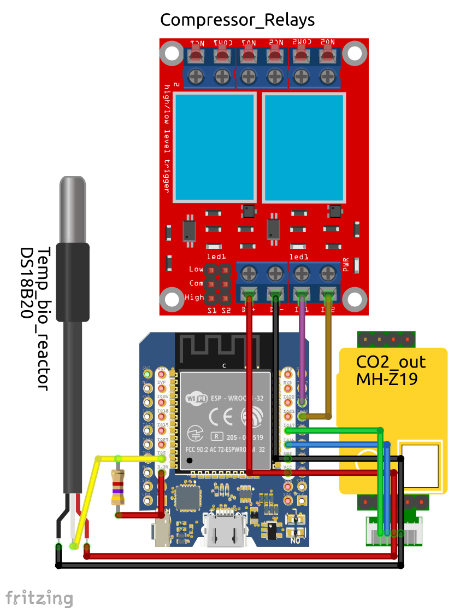

| Supported Targets | ESP32 |
| ----------------- | ----- |

# GB005 Firmware 

This application connects to an MQTT broker using ssl transport. 

It subscribes to the compressor command topic and starts reading temperature/CO<sub>2</sub> sensors and digital outputs every 30 seconds and then publishes the values to specific topics for each measurment.

When there's data published to the compressor command topic, it turns on/off two digital outputs wired to a relay module according to the command sent from the platform.

## Wiring


An external 5 V power supply must be used.

### Wriring the DS18B20 sensor:
- Vdd <- VCC pin (5 V)
- GND -> GND pin
- DQ <-> Digital Pin IO5
- A 4.7 kΩ pull-up resistor must be connected between IO5 and 3.3 V pins

### Wiring the MH-Z19B sensor to the ESP-32 module:
- Vin <- VCC pin (5 V)
- GND -> GND pin
- Tx <-> IO17 (green cable if using JST connector)
- Rx <-> IO16 (blue cable if using JST connector)
- No other MH-Z19 pins are used

## Wiring the relay module:
- D+ <- VCC pin (5 V)
- D- -> GND pin
- IN1 <- IO25
- IN2 <- IO32

## Used Libraries

### MQTT
This application is based on the ESP-MQTT SSL Sample application. It uses ESP-MQTT library which implements mqtt client to connect to mqtt broker.
User can define broker connections parameters as shown in the `keys_example.h` and must add the pem certificate provided by the vendor in the project directory.

### DS18B20 Temperature Sensor
To read temperature it uses David Antliff's [example application for the Maxim Integrated DS18B20 Programmable Resolution 1-Wire Digital Thermometer device](https://github.com/DavidAntliff/esp32-ds18b20-example).

### MHZ-19B CO<sub>2</sub> Sensor
To read CO<sub>2</sub> it uses a partially ported library of the [Arduino IDE library for operating the MH-Z19 and MH-Z19B CO2 sensor](https://github.com/crisap94/MHZ19/tree/master). 
Currently it only works to read data from an MH-Z19 sensor connected to a specific UART serial port, but more functions can be enabled to fully control the sensor's parameters such as calibration. 
PWM CO<sub>2</sub> reading is **not** implemented.
The port was done by [Leopoldo Zimpers](https://github.com/lzimperz/) and then adapted to the application.

## How to use

### Hardware Required

This program was designed to run on a WeMos D1 Mini ESP32 board, but can be adapted to any other ESP32 board, changing the used pins to connect the sensors.

### Configure the project

* Open the project configuration menu (`idf.py menuconfig`)
* Configure Wi-Fi or Ethernet under "Example Connection Configuration" menu. See "Establishing Wi-Fi or Ethernet Connection" section in `examples/protocols/README.md` of the ESP-IDF library for more details.
* For this particular board disable the brownout detection, because it seems to have voltage level issues that make the processor to restart constantly when it tries to connect to a WI-FI Network.
* CA certificate for this application have to be requested to AllThingsTalk support and has to be saved in the `main` directory as "att.pem".

### Build and Flash

Build the project and flash it to the board, then run monitor tool to view serial output:

```
idf.py -p PORT flash monitor
```

(To exit the serial monitor, type ``Ctrl-]``.)

## Example Output

```
I (3714) event: sta ip: 192.168.0.139, mask: 255.255.255.0, gw: 192.168.0.2
I (3714) system_api: Base MAC address is not set, read default base MAC address from BLK0 of EFUSE
I (3964) MQTT_CLIENT: Sending MQTT CONNECT message, type: 1, id: 0000
I (4164) MQTT_TEST: MQTT_EVENT_CONNECTED
I (4174) MQTT_TEST: sent publish successful, msg_id=41464
I (4174) MQTT_TEST: sent subscribe successful, msg_id=17886
I (4174) MQTT_TEST: sent subscribe successful, msg_id=42970
I (4184) MQTT_TEST: sent unsubscribe successful, msg_id=50241
I (4314) MQTT_TEST: MQTT_EVENT_PUBLISHED, msg_id=41464
I (4484) MQTT_TEST: MQTT_EVENT_SUBSCRIBED, msg_id=17886
I (4484) MQTT_TEST: sent publish successful, msg_id=0
I (4684) MQTT_TEST: MQTT_EVENT_SUBSCRIBED, msg_id=42970
I (4684) MQTT_TEST: sent publish successful, msg_id=0
I (4884) MQTT_TEST: deliver_publish, message_length_read=19, message_length=19
I (4884) MQTT_TEST: MQTT_EVENT_DATA
I (5194) MQTT_CLIENT: deliver_publish, message_length_read=19, message_length=19
I (5194) MQTT_TEST: MQTT_EVENT_DATA
  T: 22.938 degC
I (6496463) MQTT_TEST: sent publish successful, msg_id=0
I (6558273) MQTT_TEST: MQTT_EVENT_DATA
TOPIC=device/XXX/asset/actcompr/command
DATA={"at":"2023-09-16T23:29:50.084014Z","value":false,"meta":null}
I (6558283) I/O TEST: Outputs set to OFF
```

